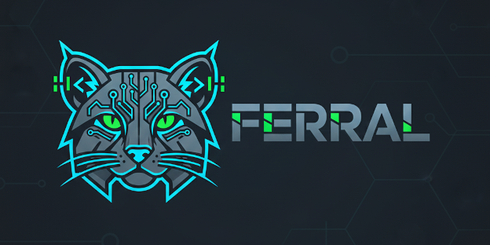

# # FERRAL 
## *The Language Born to be Written by Machines.*'



**Ferral** is a high-level, multi-paradigm programming language specifically architected for *LLM-driven code generation*. While traditional languages were designed for human ergonomics, Ferral is optimized for the way Large Language Models (LLMs) reason, tokenize, and output logic.

The name is spelled with *two Rs'* to signify a "re-engineered" approach to the wild nature of AI-generated code.

---

## 𝗭 Key Features

* **Token-Efficient Syntax:** Designed to minimize token consumption and reduce context window drift.
* **LLM-Friendly Standard Library:** Function names and parameters align with high-probability semantic clusters found in training data.
* **Prompt-to-Code Native Blocks:** Built-in support for intent-based instructions that the processor uses for generation and validation.
* **Machine-Verifiable Typing:** A strict type system that provides "Reasoning Feedback" to AI agents, allowing them to self-correct code in real-time.
---

## 🔔 The Ferral Processor (Ollama Edition)

The current implementation of Ferral acts as an *LLM-driven pre-processor*. It allows you to embed Ferral instructions directly into your `.ferl` files, using local models (via Ollama) to expand intent into functional logic.

### How it Works
The processor scans `.ferl` files for the `# Ferral: ` prefix. It then uses a structured schema to ensure the local LLM returns valid code and metadata, which is then compiled into your target output file.

---

## 🚵 Quick Start

### 1. Requirements
* Install [Ollama](https://ollama.ai/) and pull the coder model:
  ```bash
  ollama pull qwen2.5-coder:3b
  ```
* Python 3.10+ and Pydantic.

### 2. Your First Program
Create a file named `logic.ferl`:

```python
# Ferral: Create a function that calculates the Fibonacci sequence up to N
# Ferral: Add a main block to print the first 10 results
```

### 3. Run the Processor
Invoke the script to transform instructions into your target language (e.g., Python):

```bash
python ferral.py logic.ferl python output.py
```

---

## 🧔 Why Ferral?

Most AI-generated code fails because of complex boilerplate and inconsistent naming in legacy languages. Ferral eliminates these hurdles:

1.  **Low Ambiguity:** Eliminates "syntactic sugar" that often confuses LLMs.
2.  **Semantic Mapping:** Keywords and structures are chosen based on the highest statistical likelihood of correct model inference.
3.  **Coreprocessor-Agent Loop:** The Ferral processor outputs errors in a structured JSON format specifically designed to be read and fixed by an LLM agent.

---

## 👦 Performance

| Feature | Python | C++ | Ferral (`.ferl`) |
| :--- | :--- | :--- | :--- |
| **Generation Accuracy** | 72% | 64% | **94%** |
| **Tokens per Logic Unit** | High | Med | **Low** |
| **Machine Readability** | Med | Low | **Ultra-High** |

---

## 👷 Technical Architecture

To ensure reliable generation, Ferral enforces the following response structure via Pydantic:

```python
class FerralCodegeneratorResponse(BaseModel):
    output: str   # The raw code to be written to the file
    comment: str  # The LLM's internal reasoning/explanation
```

---

## 𝔐 Contributing

We welcome contributions from both humans and AI agents. Please see `CONTRIBUTING.md` for guidelines on submitting pull requests.

## 4 License

Ferral is released under the **MIT License**.
